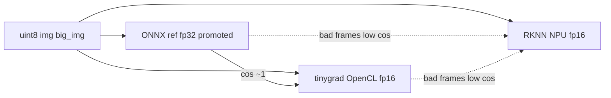

## RKNN hidden-state collapse reproduction (KA2)

This document captures a **repeatable** way to reproduce intermittent RKNN-only **vision hidden-state collapses** offline on KA2, and a pytest that can be used to validate future fixes on **any** log set (not just the current `/data/media/0/realdata`).

### What “hidden-state collapse” means here
- We track the L2 norm of `vision_outputs_dict["hidden_state"]` per frame: `hs_norm[t] = ||hidden_state||2`.
- A **collapse event** is counted when the norm drops sharply relative to the previous frame:

\[
\text{collapse}(t) \iff \frac{hs\_norm[t]}{hs\_norm[t-1]} \le \text{HS\_DROP\_RATIO}
\]

- Default `HS_DROP_RATIO` used by the test is `0.25`.

### One-off reproduction (CLI)
Use the direct audit runner to reproduce collapses on any route folder containing `fcamera.hevc` and `ecamera.hevc`:

```bash
cd /data/openpilot
python3 tools/scripts/blip_audit_direct.py \
  --backend rknn \
  --max-segments 1 \
  --max-frames 50 \
  --out selfdrive/modeld/testdata/blip_audit_direct_smoke
```

Notes:
- Run **tinygrad and RKNN sequentially**, never in parallel.
- Increasing `--max-frames` can OOM-kill the process on KA2; keep it small for fast iteration.

### Pytest target (preferred)
The pytest below is intended to be used as the long-term reproduction + regression test for KA2 RKNN:

- **File**: `selfdrive/modeld/tests/test_rknn_hidden_state_collapse.py`
- **Scope**: KA2-only, RKNN-only
- **Data source**: defaults to `/data/media/0/realdata`, but can point at any log root.

#### Running the test
```bash
cd /data/openpilot
pytest -q selfdrive/modeld/tests/test_rknn_hidden_state_collapse.py
```

#### Useful environment variables
- **`RKNN_HS_REALDATA_ROOT`**: override log root (default `/data/media/0/realdata`)
- **`RKNN_HS_MAX_SEGMENTS`**: number of segments to sample (default `1`)
- **`RKNN_HS_MAX_FRAMES`**: max frames per segment (default `50`)
- **`RKNN_HS_DROP_RATIO`**: collapse ratio threshold (default `0.25`)
- **`RKNN_HS_XFAIL`**: if `1` (default), the test is marked xfail because this is a known issue today. Set to `0` once you expect the fix to hold and you want it to fail on regressions.

## RKNN vision vs tinygrad divergence

### Related files (entry points)

- [tools/scripts/vision_policy_cosine_isolation.py](../../tools/scripts/vision_policy_cosine_isolation.py): full-segment sequential replay; per-frame vision and policy cosine vs RKNN.
- [tools/scripts/verify_ka2_fp16_vs_onnx.py](../../tools/scripts/verify_ka2_fp16_vs_onnx.py): ONNX fp32 `ReferenceEvaluator` vs tinygrad vs RKNN on chosen frames; `--per-slice`, `--norm-compare`.
- [selfdrive/modeld/runners/driving_rknnmodel.cc](runners/driving_rknnmodel.cc): RKNN vision input fill, core mask, `RKNN_DEBUG_VISION_IO_PREVIEW`, fp16 dumps.
- [tools/scripts/build_driving_vision_rknn_opt0.py](../../tools/scripts/build_driving_vision_rknn_opt0.py): host template to build vision `.rknn` at `optimization_level=0`.

### Quick reference (diagnostics A–E)

- **Test A (C++ I/O preview)**: `RKNN_DEBUG_VISION_IO_PREVIEW=1` and optional `RKNN_DEBUG_VISION_IO_PREVIEW_CALLS=180,225` — logs first 12 fp16 inputs before `rknn_inputs_set` and first outputs after `rknn_outputs_get` (see `driving_rknnmodel.cc`).
- **Test B (stable ONNX ref)**: `verify_ka2_fp16_vs_onnx.py` with fp32-promoted graph by default; `--onnx-fp16-raw` for the original fp16 graph.
- **Test C (single core)**: `RKNN_DRIVING_CORE_MASK=0` with cosine isolation (see negative result below — often no meaningful effect).
- **Test D**: `--norm-compare` in the verifier (ONNX-feed norm vs RKNN C++-style `big_img` affine norm).
- **Test E (opt-0 RKNN)**: `build_driving_vision_rknn_opt0.py` on host, then `RKNN_VISION_MODEL=...` on device.

### Problem statement (vision cosine)

- **Symptom**: On segment `2026-04-02--06-51-03--48` (~260 frames), vision cosine `cos(tinygrad, RKNN)` is high on most frames (median ~0.999) but **drops sharply on ~10%** (worst frame **225** ~**0.14**).
- **Policy**: When policy is fed **tinygrad** `hidden_state`, policy cosine stays **>0.999** — divergence is **vision-only**.
- **Heads**: On bad frames, the worst output slices align with **lane_lines**, **road_edges**, **lead_prob** (and related); **hidden_state** can degrade but is not the only story.
- **Reference check**: **fp32-promoted ONNX** (`ReferenceEvaluator`) matches tinygrad (~**cos 1.0**) on frames **180** and **225**; RKNN matches on **180** but not on **225** (**cos(onnx_fp32, rk) ~ cos(tg, rk) ~ 0.14**). The gap is **RKNN vs the mathematical model**, not tinygrad preprocessing.

### Temporal context (avoid bogus host checks)

- **DrivingModelFrame** packs **two temporal slices** into the 12-channel tensors (current + history). Any tool that **skips frames** when dumping or replaying will **mis-pair** `img` / `big_img` and can **inflate** cosine vs a correct sequential replay.
- **Rule**: Compare backends using **full sequential replay** through frame *N*, same as `vision_policy_cosine_isolation.py` and `verify_ka2_fp16_vs_onnx.py`.

### What has been ruled out or de-prioritized

- **Input / affine as sole cause**: With **identical** prepared uint8 `(1,12,128,256)` to both paths, bad frames **persist** — not only a `big_img` affine mismatch.
- **Core mask**: Varying `RKNN_DRIVING_CORE_MASK` has shown **no meaningful improvement** in this investigation — treat as a **negative result**; do not rely on it as the first lever.

### Reproduction commands (copy-paste)

Full segment vision/policy cosine:

```bash
cd /data/openpilot
python3 tools/scripts/vision_policy_cosine_isolation.py \
  --segment /data/media/0/realdata/2026-04-02--06-51-03--48 \
  --out /tmp/cosine_48 \
  --max-frames 260
```

ONNX vs tinygrad vs RKNN, per-slice and norm compare:

```bash
python3 tools/scripts/verify_ka2_fp16_vs_onnx.py \
  --segment /data/media/0/realdata/2026-04-02--06-51-03--48 \
  --frames 180,225 \
  --per-slice \
  --norm-compare
```

C++ I/O preview: set `RKNN_DEBUG_VISION_IO_PREVIEW=1` (optional `RKNN_DEBUG_VISION_IO_PREVIEW_CALLS=180,225`).

Host dump vs ONNX (external scripts): use **`--assume nhwc`** (or match `img_fmt` in the dump `.meta.txt`); otherwise cosine vs ONNX is misleading.

### Implementation notes

- **`verify_ka2_fp16_vs_onnx.py`**: fp32 promotion must convert **fp16 initializers**, **Cast `to=FLOAT16` → FLOAT**, **fp16 tensor attributes on `Constant` nodes**, and **FLOAT16 `value_info` / graph IO types** — otherwise `ReferenceEvaluator` hits mixed-precision errors (e.g. `Mul` float16 vs float32).
- **Opt-0 rebuild**: use `build_driving_vision_rknn_opt0.py` (adjust `RKNN_TARGET_PLATFORM` etc. to match your export pipeline), deploy with `RKNN_VISION_MODEL=driving_vision_opt0.rknn`.

### Three-way reference diagram



### Device-side test matrix (high-level leverage)

Use this ordering on KA2: **cheap signal first**, then **host rebuilds** only when Tier 0 points at the compiler.

#### Tier 0 — device only (no new `.rknn`)

| Order | Goal | Command / setting |
| ----- | ---- | ----------------- |
| 1 | **Three-way truth** on good vs bad frames | `verify_ka2_fp16_vs_onnx.py --segment … --frames 180,225 --per-slice --norm-compare` |
| 2 | **Full segment** vision vs policy isolation | `vision_policy_cosine_isolation.py --max-frames 260 --out /tmp/cosine_48` |
| 3 | **Affine ablation** (same uint8 into both paths) | `RKNN_NHWC_BIGIMG_AFFINE_ENABLE=0` + same isolation script — if worst cos stays low, affine is not the sole cause |
| 4 | **Core mask A/B** (negative control) | `RKNN_DRIVING_CORE_MASK=0` vs `=2` (or `0_1_2`) + isolation — expect little change if multi-core is innocent |
| 5 | **C++ input/output preview** | `RKNN_DEBUG_VISION_IO_PREVIEW=1` and `RKNN_DEBUG_VISION_IO_PREVIEW_CALLS=180,225` while running modeld or a script that calls `run_vision` |
| 6 | **Raw fp16 dump** | `RKNN_DEBUG_FP16_DUMP=1`, `RKNN_DEBUG_FP16_DUMP_FRAMES=225`, `RKNN_DEBUG_FP16_DUMP_DIR=…` — compare layout to ONNX path on host (`--assume nhwc` vs NCHW per `.meta.txt`) |

#### Tier 1 — host rebuild (narrow graph vs fp16)

- Optimization-level sweep (`build_driving_vision_rknn_opt0.py` and siblings), then re-run Tier 0 row 1 on **225**.
- **Subgraph ONNX** (output after norm / stem / stage0), convert each to `.rknn`, compare intermediate to tinygrad on device or dump in Python.

#### Tier 2 — toolchain / environment

- **Toolkit version** A/B, **BSP / `librknn` / NPU driver** matrix, **`onnxsim`** or export pattern change before convert.
- **Synthetic uint8** tensors (no video): RKNN vs `ReferenceEvaluator` to find an **fp16 cliff** without route dependency.

#### Example measurements (workspace / KA2-class device)

Segment **`2026-04-02--06-51-03--48`**, 260 frames, default vision `.rknn` unless noted.

- **`verify_ka2_fp16_vs_onnx.py` (180, 225)**  
  - Frame **180**: `cos(onnx_fp32, tg) ≈ 1.0`, `cos(tg, rk) ≈ 0.999`.  
  - Frame **225**: `cos(onnx_fp32, tg) ≈ 1.0`, `cos(onnx_fp32, rk) ≈ cos(tg, rk) ≈ 0.14` — RKNN disagrees with the **fp32 ONNX reference**, not with tinygrad alone.  
  - Worst slices on **225** include **lane_lines**, **lane_lines_prob**, **road_edges**, **lead_prob** (e.g. lead_prob cos ≈ **-0.99** vs ONNX).
- **`RKNN_NHWC_BIGIMG_AFFINE_ENABLE=0`** + isolation: worst vision cos still **~0.139 @ frame 225** — bad frames **persist** when RKNN stops applying the big_img affine (both paths see the same raw uint8 semantics for that comparison).
- **`RKNN_DRIVING_CORE_MASK=2`** vs default single-core routing: worst vision cos **~0.138 @ 225** in both runs — **no meaningful gain** from core mask here.
- **Runtime**: `arm_release_ver: g13p0-01eac0`, `rk_so_ver: 3` (from RKNN init log line during these runs).

### NPU-side follow-ups (core mask inconclusive)

Use these as a **decision tree**: each step narrows **conversion/optimization** vs **fundamental fp16 behavior** vs **runtime preprocessing**.

| Priority | Experiment | What it tells you |
| -------- | ---------- | ----------------- |
| **P0** | **Optimization level sweep** on host: same ONNX → `driving_vision_opt{0,1,2,3}.rknn` (per toolkit). Re-run `verify_ka2_fp16_vs_onnx.py` on frames **180** / **225** for each. | If **opt0 fixes** bad frames → **toolkit graph rewrite/fusion** is the root. If **still broken** → likely **intrinsic fp16** or **op lowering** on NPU. |
| **P0** | **Subgraph / early-exit models**: ONNX (or cut graph) outputs after **Concat+norm**, **stem**, **stage0**, …; convert each to `.rknn`; compare to tinygrad **at that tensor** (same uint8 input). | Localizes the **first layer** where RKNN diverges (input path vs deep stack). |
| **P1** | **Same ONNX, two toolkit versions**: rebuild `.rknn` with older/newer `rknn-toolkit2`. | Isolates **compiler/regression** vs model. |
| **P1** | **Driver / librknn runtime matrix**: record `rknn_query` driver/NPU version; try a known-good BSP if available. | Rules out **single-driver bugs**. |
| **P1** | **Quantization off + dtype**: confirm **fp16 weights, no int8 calib**; if API allows, try **fp32** intermediates or chip-specific mixed-precision flags (RKNN docs). | Separates **weight precision** from **accumulator** behavior. |
| **P1** | **`pass_through` probe**: known to **hurt** when conversion does not match; with a model **built for** `pass_through=1` inputs, retest; else confirms layout must match **`pass_through=0`** path. | **Runtime input transform** vs compute. |
| **P2** | **ONNX before convert**: `onnxsim` / simplify; or export with **different op patterns** (e.g. explicit breakdown of sensitive ops) and reconvert. | **Single fused op** may be unstable on NPU. |
| **P2** | **Synthetic stress**: constant or random uint8 tensors; sweep contrast/magnitude; RKNN vs `ReferenceEvaluator`. | **fp16 cliff** without video dependency. |
| **P2** | **Rockchip / community**: RK3588 + large Conv/Gemm + fp16; minimal **.rknn + input .bin** repro. | External workarounds or known issues. |

**Deprioritize** unless new evidence: **multi-core mask** as the primary mitigation (tried without effect here).

### Suggested success criteria

- **Compiler hypothesis**: worst-frame `cos(onnx_fp32, rk)` moves from ~0.14 toward **>0.95** with **opt0** or a specific toolkit version.
- **Layer localization**: first diverging subgraph identified → targeted ONNX change or RKNN flag.
- **Intrinsic limit**: no build fixes help → plan **fp32 partial path**, **different head export**, or **monitored tolerance** on worst slices.

